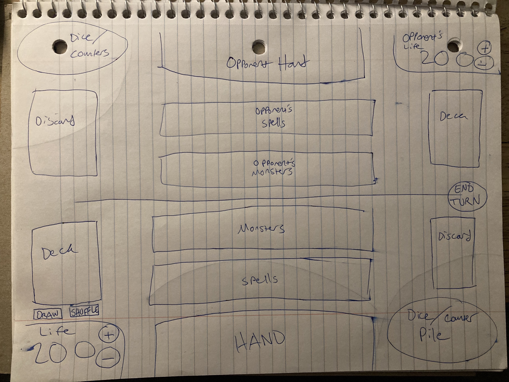
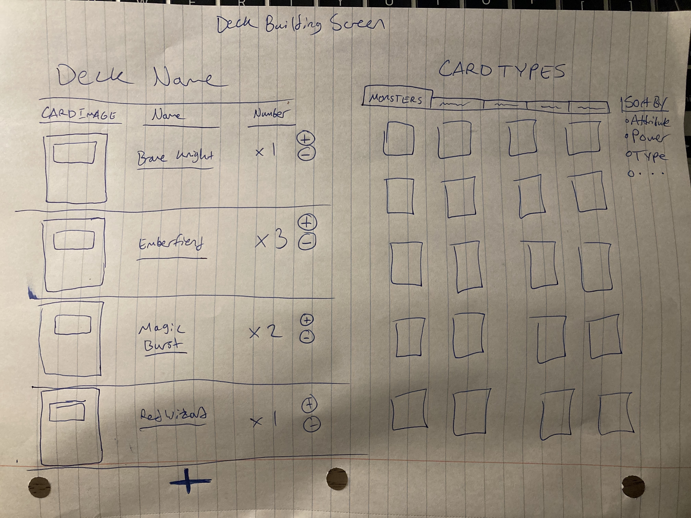

# Startup
## Specification Deliverable
*Note from the Developer* - Since this is quite an ambitious project, and I have a very busy semester, this project will be getting toned down to a simpler one. I have not edited this startup deliverable yet, but I will soon. Basically, the website will be a homepage for my novel, with links to an interactive map, character bios, a link to buy the book, and even the first chapter for free! I might also plug my music in there :) toodaloo!
### Elevator Pitch

So many people love to play their favorite trading card games online, but they run into paywalls, or there just isn’t a suitable software available! This is *Clash!* A site made for that exact reason. It is an easily customizable deck builder with an interactive multiplayer battlefield, complete with a pre-existing database of cards for the game *Mythic Magic Monsters*, created by me. It will make this fun and exciting card game available to everyone who wants to play it, completely free of charge!

This is a rough sketch of the battlefield for the game.

And this is a rough sketch of the deck builder interface.

### Key Features

*Clash* will feature multiple elements that make the experience fun and accessible to the user. Some of these are...

* Secure login and profile creation.

* A powerful deck editor, complete with card visuals, quick adding and quick removing cards, sorting and save functions. Users can simply click to add the cards they want to their deck.

* A profile page where users can save and showcase the decks they've made, as well as flaunt that incredible win record.

* Players can invite their friends to join them for a game.
* Players can use any of the decks they've built to play with.
*  Interactive battlefield that updates for both players in real time.
* Public rankings for players, and for popular cards/decks.

### Technology

Multiple technologies will be used to host this site. These are the ones I plan to use so far.

* HTML - HTML will be used to structure the website. There will be 5 HTML pages, for login, for profile, for the deck builder, for the battlefield, and for the home page with the rankings. 
* CSS - CSS will be used to design and theme the site, so that it looks cool and consistent across all platforms.
* Javascript - Javascript will be used for login, interactive deck building, interactive game-playing, and scores.
* AWS - Amazon webservices will host the site. Their servers will store people's profile information, saved decks, and scores.
* Websocket - Enables realtime multiplayer interaction on the game field.
* React - Assist development in Javascript.